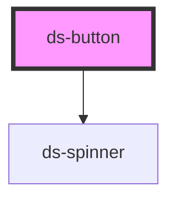

# ds-button

<!-- Auto Generated Below -->

## Properties

| Property    | Attribute    | Description | Type                                  | Default     |
| ----------- | ------------ | ----------- | ------------------------------------- | ----------- |
| `disabled`  | `disabled`   |             | `boolean`                             | `false`     |
| `fullWidth` | `full-width` |             | `boolean`                             | `false`     |
| `loading`   | `loading`    |             | `boolean`                             | `false`     |
| `size`      | `size`       |             | `"lg" \| "md" \| "sm"`                | `'md'`      |
| `type`      | `type`       |             | `"button" \| "reset" \| "submit"`     | `'button'`  |
| `variant`   | `variant`    |             | `"ghost" \| "primary" \| "secondary"` | `'primary'` |

## Dependencies

### Depends on

- [ds-spinner](../spinner)

### Graph

----------------------------------------------

*Built with [StencilJS](https://stenciljs.com/)*
