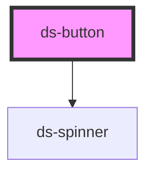

# ds-button

<!-- Auto Generated Below -->

## Properties

| Property    | Attribute    | Description                               | Type                                              | Default     |
| ----------- | ------------ | ----------------------------------------- | ------------------------------------------------- | ----------- |
| `disabled`  | `disabled`   | Whether the button is disabled            | `boolean`                                         | `false`     |
| `fullWidth` | `full-width` | Whether the button should take full width | `boolean`                                         | `false`     |
| `loading`   | `loading`    | Whether the button is in loading state    | `boolean`                                         | `false`     |
| `size`      | `size`       | The button size                           | `"lg" \| "md" \| "sm"`                            | `'md'`      |
| `type`      | `type`       | Button type attribute                     | `"button" \| "reset" \| "submit"`                 | `'button'`  |
| `variant`   | `variant`    | The button variant                        | `"danger" \| "ghost" \| "primary" \| "secondary"` | `'primary'` |

## Dependencies

### Depends on

- [ds-spinner](../spinner)

### Graph

----------------------------------------------

*Built with [StencilJS](https://stenciljs.com/)*
