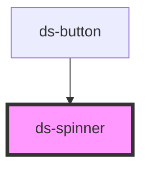

# ds-spinner

<!-- Auto Generated Below -->

## Properties

| Property | Attribute | Description | Type                   | Default |
| -------- | --------- | ----------- | ---------------------- | ------- |
| `size`   | `size`    |             | `"lg" \| "md" \| "sm"` | `'md'`  |

## Dependencies

### Used by

- [ds-button](../button)

### Graph

---

_Built with [StencilJS](https://stenciljs.com/)_
